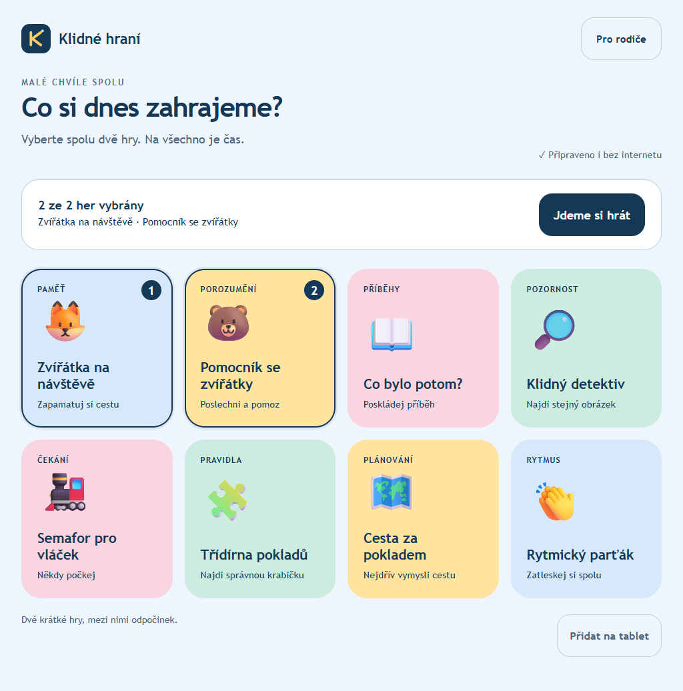

# Klidné hraní

Osm českých her pro společné hraní rodiče a dítěte. Webová aplikace funguje po prvním stažení i offline a lze ji nainstalovat na Android jako PWA.

**[Spustit hry](https://zakkomino.github.io/klidne-hrani/)** · [Instalace na Android](docs/INSTALACE.md)

## Hry

Paměťové domečky, plnění pokynů, skládání příběhů, hledání obrázků, semafor, třídění, plánování cesty a rytmus. Dvanáct obrázkových příběhů, 110 českých hlasových pokynů, dva krátké bloky s přestávkou a přehled pro rodiče.

Výsledky zůstávají v prohlížeči zařízení. Bez účtu dítěte, reklam, analytiky, mikrofonu a cloudového přenosu výsledků. Export JSON/CSV a obnova ze zálohy jsou v rodičovském přehledu. Hry jsou pomůckou pro procvičování; nejsou diagnostikou ani ověřenou léčbou.

## Dokumentace

- [Veřejná anonymizovaná specifikace a domácí plán](docs/specifikace/Domaci_plan_a_zadani_webovych_her.docx)
- [Rozsah anonymizace](docs/ANONYMIZACE.md)
- [Technický popis](docs/TECHNICKY_POPIS.md)
- [Výzkumné podklady](docs/PODKLADY.md)
- [Zvuk a ilustrace](docs/AUDIO.md)
- [Ověření](docs/verification/OVERENI.md)
- [Nasazení přes GitHub Pages](docs/NASAZENI.md)

Veřejná dokumentace obsahuje obecné funkční východisko. Neobsahuje původní fotografii zdravotní zprávy, identifikátory dítěte ani podrobná individuální měření.

## Vývoj

Node.js 22+, bez produkčních balíčkových závislostí.

```sh
node --test tests/logic.test.mjs
node scripts/check.mjs
python scripts/check-public.py
node scripts/build.mjs
node scripts/serve.mjs
```

Do GitHub Pages se publikuje výhradně `dist/`. Vývojové skripty a dokumentace jsou součástí repozitáře, nikoli instalovaného webového balíčku. `private: true` v package.json brání omylu při publikování balíčku do npm; neomezuje dostupnost GitHub repozitáře ani webu.


